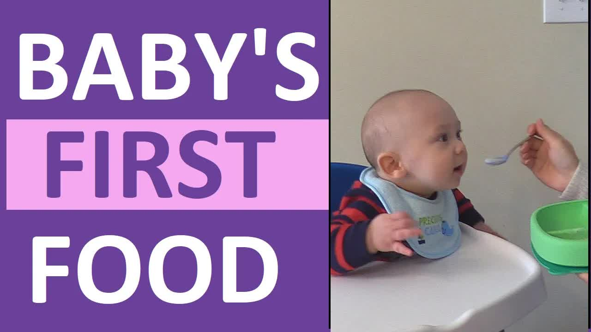

# Baby's-First-Food-Reaction-at-6-Months-Old-｜-How-to-Start-Solids-｜-Pediatric-Nursing

  <picture>
    
  </picture>

 

---

## Video Information

| Property | Value |
|----------|-------|
| **Video Name** | `Baby's-First-Food-Reaction-at-6-Months-Old-｜-How-to-Start-Solids-｜-Pediatric-Nursing` |
| **Original Link** | [YouTube Video](https://www.youtube.com/watch?v=QlqfrjGwIWM&list=PLQrdx7rRsKfV0r_mdcI_5YQJF3BHNWMc8&index=6&pp=iAQB) |
| **Total Size** | **2 parts** - **55.43 MB** |
| **Quality** | **720** |
| **Status** | **Complete (100%)** |
| **Password Protected** | **NO** |

---

## Download Links

> ⬇️ Download **all parts**, then open `Baby's-First-Food-Reaction-at-6-Months-Old-｜-How-to-Start-Solids-｜-Pediatric-Nursing.zip` — the other parts are found automatically.

| # | File | Link |
|---|------|------|
| 1 | `Baby's-First-Food-Reaction-at-6-Months-Old-｜-How-to-Start-Solids-｜-Pediatric-Nursing.z01` | [Download](https://raw.githubusercontent.com/hoomanjoodaki1388/Ourtube/main/videos/Baby%27s-First-Food-Reaction-at-6-Months-Old-%EF%BD%9C-How-to-Start-Solids-%EF%BD%9C-Pediatric-Nursing/Baby%27s-First-Food-Reaction-at-6-Months-Old-%EF%BD%9C-How-to-Start-Solids-%EF%BD%9C-Pediatric-Nursing.z01) |
| 2 | `Baby's-First-Food-Reaction-at-6-Months-Old-｜-How-to-Start-Solids-｜-Pediatric-Nursing.zip` | [Download](https://raw.githubusercontent.com/hoomanjoodaki1388/Ourtube/main/videos/Baby%27s-First-Food-Reaction-at-6-Months-Old-%EF%BD%9C-How-to-Start-Solids-%EF%BD%9C-Pediatric-Nursing/Baby%27s-First-Food-Reaction-at-6-Months-Old-%EF%BD%9C-How-to-Start-Solids-%EF%BD%9C-Pediatric-Nursing.zip) |

---

## How to Extract

Download all parts into the **same folder**, then:

| OS | Steps |
|----|-------|
| **Windows** | Double-click `Baby's-First-Food-Reaction-at-6-Months-Old-｜-How-to-Start-Solids-｜-Pediatric-Nursing.zip` — opens in Explorer, WinRAR, or 7-Zip automatically |
| **Mac** | Double-click `Baby's-First-Food-Reaction-at-6-Months-Old-｜-How-to-Start-Solids-｜-Pediatric-Nursing.zip` — extracts with Archive Utility or The Unarchiver |
| **Linux** | `unzip Baby's-First-Food-Reaction-at-6-Months-Old-｜-How-to-Start-Solids-｜-Pediatric-Nursing.zip` or right-click → Extract Here (Ark/File Manager) |
| **Android** | Tap `Baby's-First-Food-Reaction-at-6-Months-Old-｜-How-to-Start-Solids-｜-Pediatric-Nursing.zip` in your file manager — or use [ZArchiver](https://play.google.com/store/apps/details?id=ru.zdevs.zarchiver) |

---

*This tool created by [avasam.ir](https://avasam.ir)*
