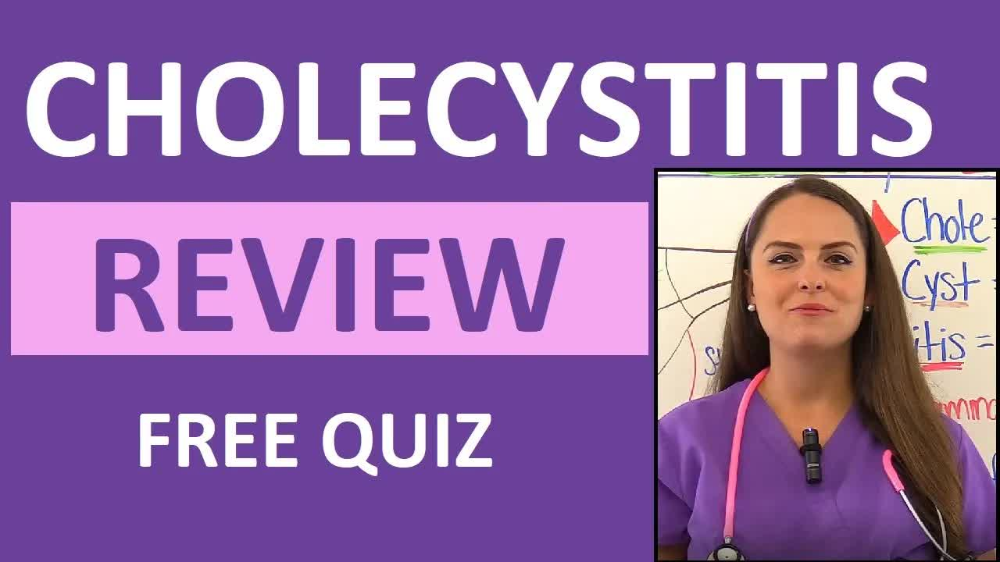

# Cholecystitis-Nursing-NCLEX-Pathophysiology,-Symptoms-(T-Tube-&-Cholecystostomy)

  <picture>
    
  </picture>

 

---

## Video Information

| Property | Value |
|----------|-------|
| **Video Name** | `Cholecystitis-Nursing-NCLEX-Pathophysiology,-Symptoms-(T-Tube-&-Cholecystostomy)` |
| **Original Link** | [YouTube Video](https://www.youtube.com/watch?v=nyBV18sHNSg&list=PLQrdx7rRsKfWpduKo2gTKhrCO8DPlUHCJ&index=2&pp=iAQB0gcJCQQLAYcqIYzv) |
| **Total Size** | **6 parts** - **254.42 MB** |
| **Quality** | **1080** |
| **Status** | **Complete (100%)** |
| **Password Protected** | **NO** |

---

## Download Links

> ⬇️ Download **all parts**, then open `Cholecystitis-Nursing-NCLEX-Pathophysiology,-Symptoms-(T-Tube-&-Cholecystostomy).zip` — the other parts are found automatically.

| # | File | Link |
|---|------|------|
| 1 | `Cholecystitis-Nursing-NCLEX-Pathophysiology,-Symptoms-(T-Tube-&-Cholecystostomy).z01` | [Download](https://raw.githubusercontent.com/hoomanjoodaki1388/Ourtube/main/videos/Cholecystitis-Nursing-NCLEX-Pathophysiology%2C-Symptoms-%28T-Tube-%26-Cholecystostomy%29/Cholecystitis-Nursing-NCLEX-Pathophysiology%2C-Symptoms-%28T-Tube-%26-Cholecystostomy%29.z01) |
| 2 | `Cholecystitis-Nursing-NCLEX-Pathophysiology,-Symptoms-(T-Tube-&-Cholecystostomy).z02` | [Download](https://raw.githubusercontent.com/hoomanjoodaki1388/Ourtube/main/videos/Cholecystitis-Nursing-NCLEX-Pathophysiology%2C-Symptoms-%28T-Tube-%26-Cholecystostomy%29/Cholecystitis-Nursing-NCLEX-Pathophysiology%2C-Symptoms-%28T-Tube-%26-Cholecystostomy%29.z02) |
| 3 | `Cholecystitis-Nursing-NCLEX-Pathophysiology,-Symptoms-(T-Tube-&-Cholecystostomy).z03` | [Download](https://raw.githubusercontent.com/hoomanjoodaki1388/Ourtube/main/videos/Cholecystitis-Nursing-NCLEX-Pathophysiology%2C-Symptoms-%28T-Tube-%26-Cholecystostomy%29/Cholecystitis-Nursing-NCLEX-Pathophysiology%2C-Symptoms-%28T-Tube-%26-Cholecystostomy%29.z03) |
| 4 | `Cholecystitis-Nursing-NCLEX-Pathophysiology,-Symptoms-(T-Tube-&-Cholecystostomy).z04` | [Download](https://raw.githubusercontent.com/hoomanjoodaki1388/Ourtube/main/videos/Cholecystitis-Nursing-NCLEX-Pathophysiology%2C-Symptoms-%28T-Tube-%26-Cholecystostomy%29/Cholecystitis-Nursing-NCLEX-Pathophysiology%2C-Symptoms-%28T-Tube-%26-Cholecystostomy%29.z04) |
| 5 | `Cholecystitis-Nursing-NCLEX-Pathophysiology,-Symptoms-(T-Tube-&-Cholecystostomy).z05` | [Download](https://raw.githubusercontent.com/hoomanjoodaki1388/Ourtube/main/videos/Cholecystitis-Nursing-NCLEX-Pathophysiology%2C-Symptoms-%28T-Tube-%26-Cholecystostomy%29/Cholecystitis-Nursing-NCLEX-Pathophysiology%2C-Symptoms-%28T-Tube-%26-Cholecystostomy%29.z05) |
| 6 | `Cholecystitis-Nursing-NCLEX-Pathophysiology,-Symptoms-(T-Tube-&-Cholecystostomy).zip` | [Download](https://raw.githubusercontent.com/hoomanjoodaki1388/Ourtube/main/videos/Cholecystitis-Nursing-NCLEX-Pathophysiology%2C-Symptoms-%28T-Tube-%26-Cholecystostomy%29/Cholecystitis-Nursing-NCLEX-Pathophysiology%2C-Symptoms-%28T-Tube-%26-Cholecystostomy%29.zip) |

---

## How to Extract

Download all parts into the **same folder**, then:

| OS | Steps |
|----|-------|
| **Windows** | Double-click `Cholecystitis-Nursing-NCLEX-Pathophysiology,-Symptoms-(T-Tube-&-Cholecystostomy).zip` — opens in Explorer, WinRAR, or 7-Zip automatically |
| **Mac** | Double-click `Cholecystitis-Nursing-NCLEX-Pathophysiology,-Symptoms-(T-Tube-&-Cholecystostomy).zip` — extracts with Archive Utility or The Unarchiver |
| **Linux** | `unzip Cholecystitis-Nursing-NCLEX-Pathophysiology,-Symptoms-(T-Tube-&-Cholecystostomy).zip` or right-click → Extract Here (Ark/File Manager) |
| **Android** | Tap `Cholecystitis-Nursing-NCLEX-Pathophysiology,-Symptoms-(T-Tube-&-Cholecystostomy).zip` in your file manager — or use [ZArchiver](https://play.google.com/store/apps/details?id=ru.zdevs.zarchiver) |

---

*This tool created by [avasam.ir](https://avasam.ir)*
