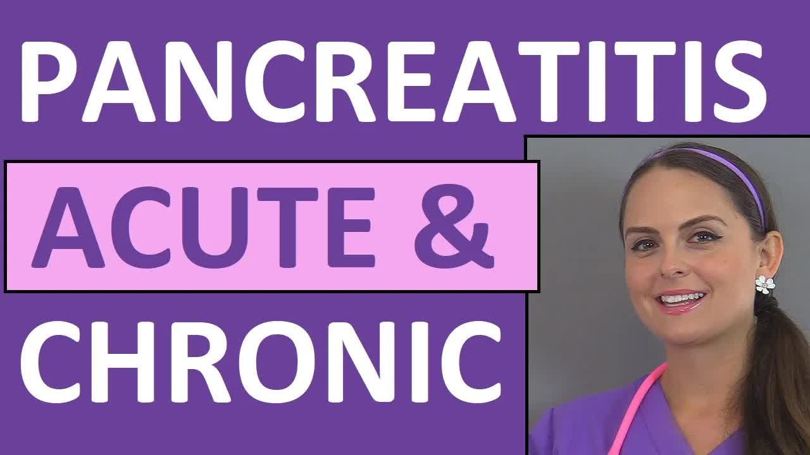

# Pancreatitis-｜-Acute-and-Chronic-Pancreatitis-Nursing-Lecture-Symptoms,-Treatment,-Pathophysiology

  <picture>
    
  </picture>

 

---

## Video Information

| Property | Value |
|----------|-------|
| **Video Name** | `Pancreatitis-｜-Acute-and-Chronic-Pancreatitis-Nursing-Lecture-Symptoms,-Treatment,-Pathophysiology` |
| **Original Link** | [YouTube Video](https://www.youtube.com/watch?v=deT4TeBsmbc&list=PLQrdx7rRsKfWpduKo2gTKhrCO8DPlUHCJ&index=8&pp=iAQB0gcJCQQLAYcqIYzv) |
| **Total Size** | **8 parts** - **349.09 MB** |
| **Quality** | **1080** |
| **Status** | **Complete (100%)** |
| **Password Protected** | **NO** |

---

## Download Links

> ⬇️ Download **all parts**, then open `Pancreatitis-｜-Acute-and-Chronic-Pancreatitis-Nursing-Lecture-Symptoms,-Treatment,-Pathophysiology.zip` — the other parts are found automatically.

| # | File | Link |
|---|------|------|
| 1 | `Pancreatitis-｜-Acute-and-Chronic-Pancreatitis-Nursing-Lecture-Symptoms,-Treatment,-Pathophysiology.z01` | [Download](https://raw.githubusercontent.com/hoomanjoodaki1388/Ourtube/main/videos/Pancreatitis-%EF%BD%9C-Acute-and-Chronic-Pancreatitis-Nursing-Lecture-Symptoms%2C-Treatment%2C-Pathophysiology/Pancreatitis-%EF%BD%9C-Acute-and-Chronic-Pancreatitis-Nursing-Lecture-Symptoms%2C-Treatment%2C-Pathophysiology.z01) |
| 2 | `Pancreatitis-｜-Acute-and-Chronic-Pancreatitis-Nursing-Lecture-Symptoms,-Treatment,-Pathophysiology.z02` | [Download](https://raw.githubusercontent.com/hoomanjoodaki1388/Ourtube/main/videos/Pancreatitis-%EF%BD%9C-Acute-and-Chronic-Pancreatitis-Nursing-Lecture-Symptoms%2C-Treatment%2C-Pathophysiology/Pancreatitis-%EF%BD%9C-Acute-and-Chronic-Pancreatitis-Nursing-Lecture-Symptoms%2C-Treatment%2C-Pathophysiology.z02) |
| 3 | `Pancreatitis-｜-Acute-and-Chronic-Pancreatitis-Nursing-Lecture-Symptoms,-Treatment,-Pathophysiology.z03` | [Download](https://raw.githubusercontent.com/hoomanjoodaki1388/Ourtube/main/videos/Pancreatitis-%EF%BD%9C-Acute-and-Chronic-Pancreatitis-Nursing-Lecture-Symptoms%2C-Treatment%2C-Pathophysiology/Pancreatitis-%EF%BD%9C-Acute-and-Chronic-Pancreatitis-Nursing-Lecture-Symptoms%2C-Treatment%2C-Pathophysiology.z03) |
| 4 | `Pancreatitis-｜-Acute-and-Chronic-Pancreatitis-Nursing-Lecture-Symptoms,-Treatment,-Pathophysiology.z04` | [Download](https://raw.githubusercontent.com/hoomanjoodaki1388/Ourtube/main/videos/Pancreatitis-%EF%BD%9C-Acute-and-Chronic-Pancreatitis-Nursing-Lecture-Symptoms%2C-Treatment%2C-Pathophysiology/Pancreatitis-%EF%BD%9C-Acute-and-Chronic-Pancreatitis-Nursing-Lecture-Symptoms%2C-Treatment%2C-Pathophysiology.z04) |
| 5 | `Pancreatitis-｜-Acute-and-Chronic-Pancreatitis-Nursing-Lecture-Symptoms,-Treatment,-Pathophysiology.z05` | [Download](https://raw.githubusercontent.com/hoomanjoodaki1388/Ourtube/main/videos/Pancreatitis-%EF%BD%9C-Acute-and-Chronic-Pancreatitis-Nursing-Lecture-Symptoms%2C-Treatment%2C-Pathophysiology/Pancreatitis-%EF%BD%9C-Acute-and-Chronic-Pancreatitis-Nursing-Lecture-Symptoms%2C-Treatment%2C-Pathophysiology.z05) |
| 6 | `Pancreatitis-｜-Acute-and-Chronic-Pancreatitis-Nursing-Lecture-Symptoms,-Treatment,-Pathophysiology.z06` | [Download](https://raw.githubusercontent.com/hoomanjoodaki1388/Ourtube/main/videos/Pancreatitis-%EF%BD%9C-Acute-and-Chronic-Pancreatitis-Nursing-Lecture-Symptoms%2C-Treatment%2C-Pathophysiology/Pancreatitis-%EF%BD%9C-Acute-and-Chronic-Pancreatitis-Nursing-Lecture-Symptoms%2C-Treatment%2C-Pathophysiology.z06) |
| 7 | `Pancreatitis-｜-Acute-and-Chronic-Pancreatitis-Nursing-Lecture-Symptoms,-Treatment,-Pathophysiology.z07` | [Download](https://raw.githubusercontent.com/hoomanjoodaki1388/Ourtube/main/videos/Pancreatitis-%EF%BD%9C-Acute-and-Chronic-Pancreatitis-Nursing-Lecture-Symptoms%2C-Treatment%2C-Pathophysiology/Pancreatitis-%EF%BD%9C-Acute-and-Chronic-Pancreatitis-Nursing-Lecture-Symptoms%2C-Treatment%2C-Pathophysiology.z07) |
| 8 | `Pancreatitis-｜-Acute-and-Chronic-Pancreatitis-Nursing-Lecture-Symptoms,-Treatment,-Pathophysiology.zip` | [Download](https://raw.githubusercontent.com/hoomanjoodaki1388/Ourtube/main/videos/Pancreatitis-%EF%BD%9C-Acute-and-Chronic-Pancreatitis-Nursing-Lecture-Symptoms%2C-Treatment%2C-Pathophysiology/Pancreatitis-%EF%BD%9C-Acute-and-Chronic-Pancreatitis-Nursing-Lecture-Symptoms%2C-Treatment%2C-Pathophysiology.zip) |

---

## How to Extract

Download all parts into the **same folder**, then:

| OS | Steps |
|----|-------|
| **Windows** | Double-click `Pancreatitis-｜-Acute-and-Chronic-Pancreatitis-Nursing-Lecture-Symptoms,-Treatment,-Pathophysiology.zip` — opens in Explorer, WinRAR, or 7-Zip automatically |
| **Mac** | Double-click `Pancreatitis-｜-Acute-and-Chronic-Pancreatitis-Nursing-Lecture-Symptoms,-Treatment,-Pathophysiology.zip` — extracts with Archive Utility or The Unarchiver |
| **Linux** | `unzip Pancreatitis-｜-Acute-and-Chronic-Pancreatitis-Nursing-Lecture-Symptoms,-Treatment,-Pathophysiology.zip` or right-click → Extract Here (Ark/File Manager) |
| **Android** | Tap `Pancreatitis-｜-Acute-and-Chronic-Pancreatitis-Nursing-Lecture-Symptoms,-Treatment,-Pathophysiology.zip` in your file manager — or use [ZArchiver](https://play.google.com/store/apps/details?id=ru.zdevs.zarchiver) |

---

*This tool created by [avasam.ir](https://avasam.ir)*
